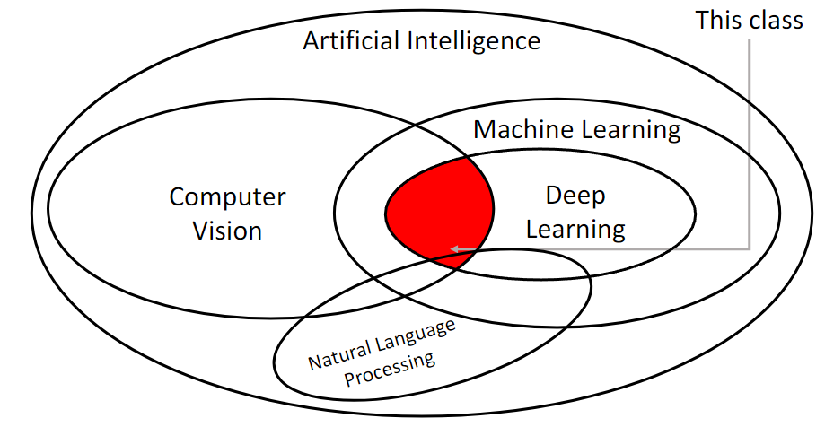
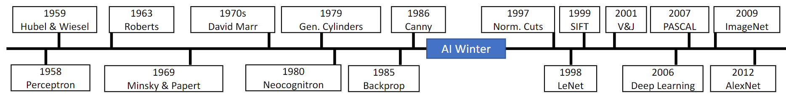
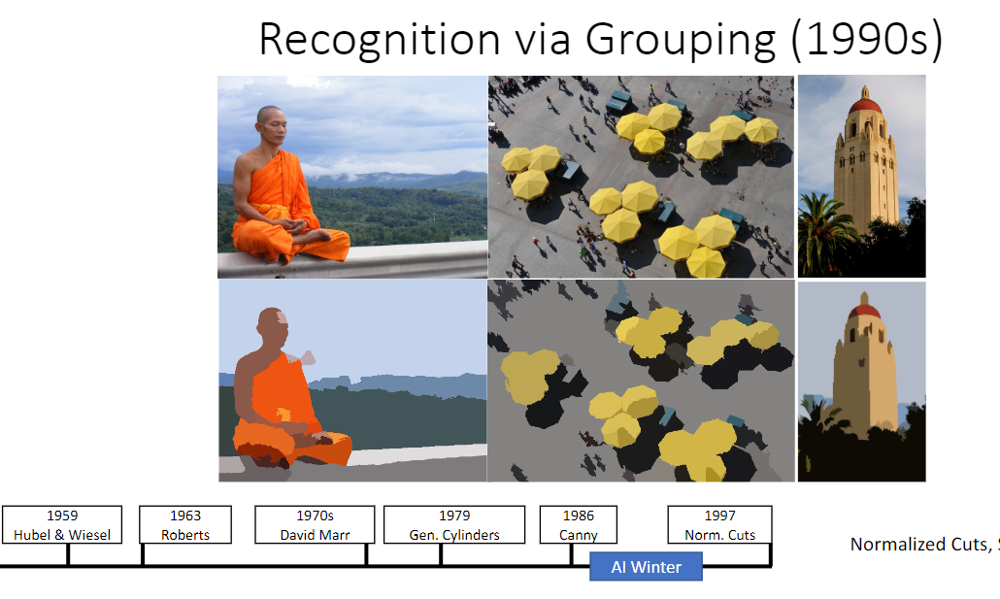
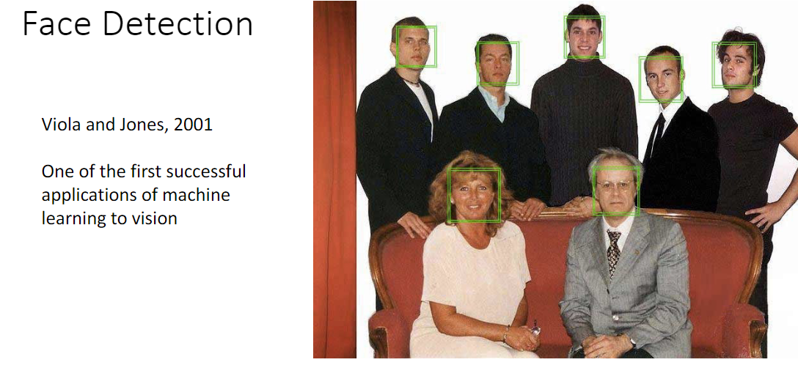
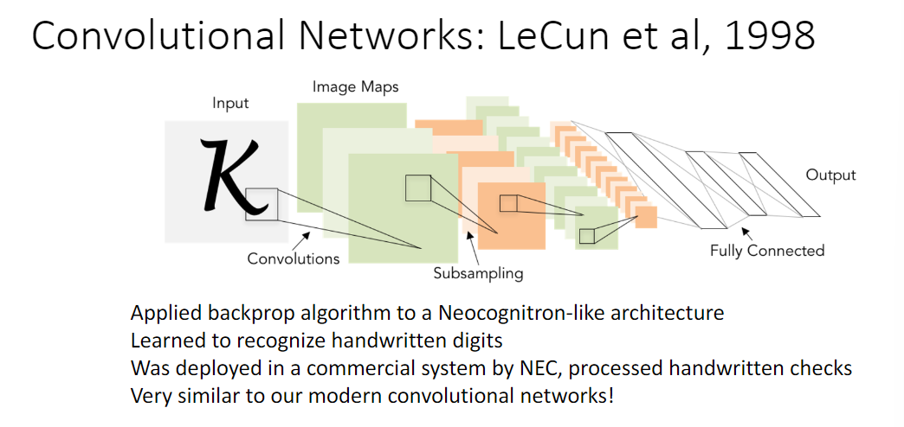

# Lecture 1：Computer vision overview

**Deep Learning：**
Hierarchical learning algorithms with many “layers”, (very) loosely inspired by the brain.

计算机视觉和深度学习研究历史是两条并行线。

## History of computer vision

**Hubel and Wiesel, 1959:**

Cat's neural cells have response to light orientation.

**Recognition via Edge Detection (1980s)**

Canny edge detector

**Norm. Cuts(1997)**

Recognition via Grouping

**Face Detection**

## History of Deep Learning

1958 年，感知机(Perceptron)被提出，是最早可以从数据里学习的算法之一，它是一种线性分类器(linear classifier)。

1969 年，Minsky and Papert 出版的《Perceptrons》一书向众人宣布“Perceptrons could not learn the XOR function”(即异或函数不能被感知机学习)，引起了领域的幻灭。其实书中提到多层的感知机(multilayer perceptron)可以解决异或问题，但并未收到太大关注。

1980 年，Fukushima 提出了新感知机(Neocognitron)，已经出现了后来的卷积层(convolution)和池化层(pooling)，但没有可以实践的训练算法。

1986 年，Rumelhart 和 Hinton 和 Williams 提出了反向传播算法(backpropagation)，成功训练了多层感知机(multilayer perceptron)。

1998 年，LeCun 等人提出了卷积神经网络(Convolutional Neural Networks, CNN)，将反向传播算法用于类似多层感知机的架构上来做手写数字识别。

2000 年，深度学习的浪潮开始，虽然不是主流，但人们开始训练越来越深的神经网络。

2012 至今，随着 AlexNet 的出现，深度学习开始爆发。

## Deep Learning is Everywhere

1. Object Detection
2. Image Segmentation
3. Video Classification
4. Activity Recognition
5. Playing Atari games (Guo et al, 2014)
6. Image Captioning Vinyals et al, 2015
   Karpathy and Fei-Fei, 2015
7. image generation 2021 DALL-E
8. ...
